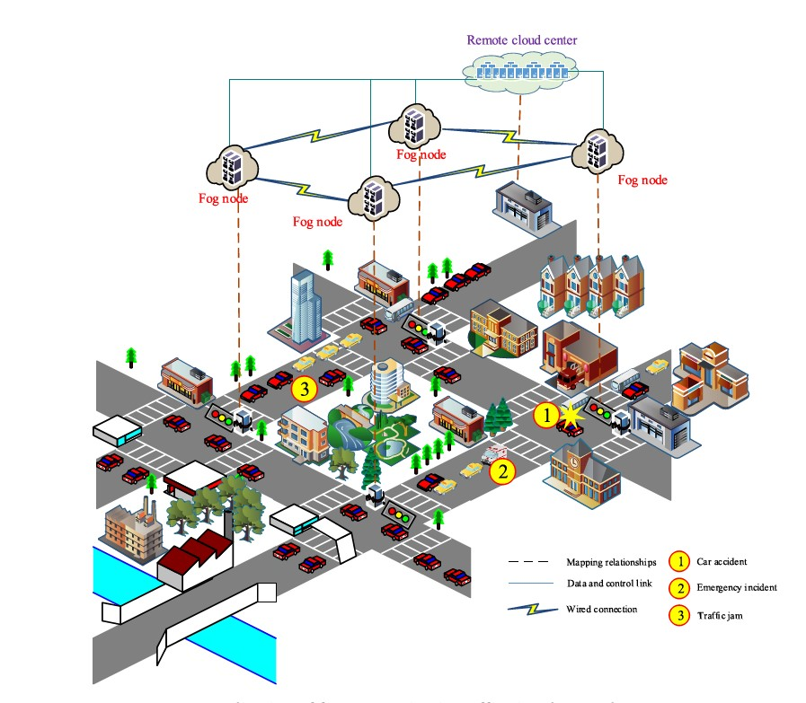

# Multi Agent Reinforcement Learning In Large Scale Traffic

Multi Agent Reinforcement Learning (MARL) are applied to the multiintersection environment. 

At every intersection, there is an intelligent agent, with the observation of the local traffic $S_{i,t}$, the agent $i$ makes the decision $A_{i,t}$. Assuming that there are $n$ intersections, then we have a combination of the actions in time slot $t$
$$A_t = (A_{1,t},A_{2,t},...,A_{n,t})$$
However, the combination of the local optimal actions may not be equal to the global optimal actions. 
Directly, we will consider that why not applying a global agent to manage the traffic? 
There are two reasons:
1. The computation will grow exponentially with the growth of the intersection. Assuming that for each agent, it only needs to decide that change the phase or keep the current phase, thus with $n$ intersections, the action space will be $2^n$
2. For traffic control, timeliness is the first priority. Even if the central agent has the enough capability to proceed the data, the transmission of data and the processing will cost the lots of time, which would result in the delay of the decision.

Compared with the one-intersection problem, the multi-intersection problem is more complicated. Not only the increment of the number of agent, but also the environment that each agent faces changes. The adjacent intersections can affect each other due to the local decisions. 

### Recommended Paper
1. [Integrating Independent and centralized multi agent reinforcement learning for traffic signal network optimization](https://arxiv.org/abs/1909.10651)
2. [Cooperative Deep Reinforcement Learning for LargeScale Traffic Grid Signal Control](https://ieeexplore.ieee.org/document/8676356)
3. [CoLight: Learning Networklevel Cooperation for Traffic Signal Control](https://arxiv.org/abs/1905.05717)
4. [MultiAgent Deep Reinforcement Learning for LargeScale Traffic Signal Control](https://ieeexplore.ieee.org/document/8667868)
5. [Coordinated Deep Reinforcement Learners for Traffic Light Control](https://pure.uva.nl/ws/files/10793554/vanderpol_oliehoek_nipsmalic2016.pdf)
  
### **Summary**
#### Integrating Independent and centralized multi agent reinforcement learning for traffic signal network optimization

In this paper, they use the weighted summation of the local rewards as the global reward, rather than adding them directly. Firstly, they use the pagerank algorithm to calculate the rank of each individual reward. Since the traffic in the central area has higher risk of congestion, these places should have a higher priority.
$$R^g(s,a): = \sum_{n=1}^N k_nR^n(s,a)$$
and $k_n=PageRank(n)$

The whole system can be divided into three parts: the individual part and the system part. 

For the individual part, the individual agent makes decisions based on the local information, and recieves the local reward. It's worth mentioning that they apply a technology called as '*[parameter sharing](https://www.aaai.org/ocs/index.php/AAAI/AAAI18/paper/viewPaper/17193)'*

For the global part, they use the defined global reward, the action made by the local agents and the global state to train the global agent.

To slove the coordinate problem, they wish the weighted summation of the individual $Q$ value can be close to the global Q value as much as possible. Therefore, they designed the regulizer 
$$L_{reg}= E_\pi[\frac{1}{2}(Q_w^\pi(s,A)-\sum_{n=1}^Nk^nQ_{\theta}^n(o_n,A_n))^2]$$
where $Q_w^\pi(s,A)$ is the global Q value, and the latter one is the summation

The total loss is the sum of the individual loss, the global loss and the weighted reg loss.

#### CoLight: Learning Networklevel Cooperation for Traffic Signal Control
Similar to the previous paper, they also consider how to arrange the weight to the neighbor intersections. In this paper they introduce the 'attention mechanism', which is widely used in the CV and the NLP. 

The problem is done with 5 steps:
- Step 1 : Using the multi layer perceptron to tranform the input vector $o_i$ into the hidden state vector $h_i$.
- Step 2 : With calculating the inner product of $<h_i,h_j>$,
  $$e_{ij} = (h_iW_t)\cdot(h_jW_s)^T$$ 
  and the obtain the scala $e_{ij}$ which represents the importance of information from the intersection $j$ to determine the policy for intersection $i$
- Step 3 : With the $softmax$ function to normalize the $e_{ij}$
  $$\alpha_{ij} = \frac{\exp(e_{ij}/\tau)}{\sum_{j\in N_i}\exp(e_{ij}/\tau)}$$
  Using the manhattan distance as the mesurement to calculate the $N_i$, the $\tau$ is the temperature factor.
- Step 4 : Calculate the attention representation $h_{si}$
  $$h_{si} = \sigma(W_q\cdot\sum_{j\in N_i}\alpha_{ij}(h_jW_c)+b_q)$$
  Here since there are many intersections, they extend the previous signal attention to multi-head attention.
  $$h_{mi} = \sigma(W_q\cdot(\frac{1}{H}\sum_{h=1}^{h=H}\sum_{j\in N_i}\alpha_{ij}^h(h_jW_c^h))+b_q)$$

  This calculation is done in the layer called NCvA (Neighborhood Cooperation via Attention)
- Step 5 : Via the NCvA we calculate the predicted q value $\hat q$ then to optimize the loss function $L$
  $$L(\theta)=\frac{1}{T}\sum_{T}^{t=1}\sum_{i=1}^{N}(q(o^t_i,a_i^t)-\hat q(o^t_i,a_i^t,\theta))^2$$
  $T$ is the total number of time steps, and the $N$ is the number of intersections.

#### Cooperative Deep Reinforcement Learning for LargeScale Traffic Grid Signal Control
This paper focuses on how to reduce the calculation for pursuiting the global Q value. If we calculate the global Q value directly, as we mentioned before, it's unimageable hard to compute with the number of intersections grows. Thus, in this paper, they search for the optimal global policy based on the individual policy. 
This process can be divided into 3 steps:
- Step $1$ : With the local information, train the local agent and obtain the action $a_i^t$for agent $i$ under state $s_i^t$
- Step $2$ : Organize the local region with several agents. The global area is divided into $m$ regions. Combining the actions from every region, we have a action set consisting of every individual agent's action, that's $A^t = (a_1^t,a_2^t,...,a_n^t)$.
- Step $3$ : Based on $A^t$, we choose one region, fix the actions from other regions and change the action in the chosen region, to find the actions combination which have the largest global Q value. Then one by one change the region and do the same. 

With above approach, they reduce the search space from $2^n$ to $m\cdot2^{N/m}$. Though the performance is really good, but the policy learned based on this maybe not optimal. I think that there is some trade-off between optimal and calculation. 
